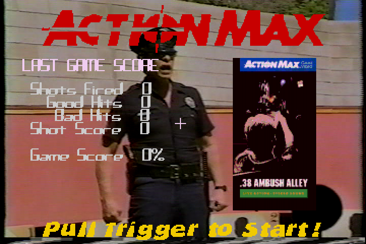

# ActionMax for Pi
---
#### Following the release of Debian Bookworm, this emulator is now obsolete and will be archived.
---
#### Original Context follows:

This is a companion emulator for [hypseus-singe](https://github.com/DirtBagXon/hypseus-singe). It allows certain generations of SBC's (_inc. Raspberry Pi_) to overcome display driver issues with _SDL2_ reading pixel data from the display. It is designed to run in a _libretro_ style environment as dictated by the `-retropath` argument in Hypseus Singe.

ActionMax was a **VHS** based lightgun game: [Wikipedia](https://en.wikipedia.org/wiki/Action_Max)

_Hypseus_ can run _ActionMax_ games on most platforms, use _Hypseus_ when possible.

If **"_Targets Disabled_"** is displayed in _Hypseus Singe_, then try this emulator.

This emulator uses _SDL1.2_ libraries and is based around the original Singe by Scott Duensing.

It should be used as a ROM specific emulator for [ActionMax](https://en.wikipedia.org/wiki/Action_Max) games:

`38ambushalley` `bluethunder` `hydrosub2021` `popsghostly` `sonicfury`

It can be operated by **joystick**, **mouse** or **lightgun** as originally intended.

See further information in [discussions](https://github.com/DirtBagXon/actionmax-pi/discussions/1).

### RetroPie install
Use `actionmax.sh` for _RetroPie-Setup_

    wget https://raw.githubusercontent.com/DirtBagXon/actionmax-pi/main/actionmax.sh -O $HOME/RetroPie-Setup/scriptmodules/emulators/actionmax.sh

    sudo $HOME/RetroPie-Setup/retropie_setup.sh

The package will appear in (_exp_)

Use `.commands` file for optional argument as per [_Hypseus/Daphne_](https://retropie.org.uk/docs/Daphne/#command-parametres).

## Configuration

See **README** on _ActionMax_ `ROM` setup in _libretro_ style environments [here](https://github.com/DirtBagXon/hypseus_singe_data/blob/master/00-singe1/actionmax/README.md)

Configuration should be made within `singeinput.ini` as per [_Daphne_](https://www.daphne-emu.com:9443/mediawiki/index.php/Input) _SDL1_ [keycodes](https://www.daphne-emu.com:9443/mediawiki/index.php/KeyList).

## Run

Use standard _Daphne_ and _Singe_ arguments with this emulator.

**Note:** `-script` is not used in this implementation. The `.singe` file should be the first argument.

    actionmax.bin 38ambushalley.singe -framefile 38ambushalley.txt -homedir "/opt/retropie/emulators/actionmax" -fullscreen_window

## Extended arguments

Below are extended arguments used in this emulator:

    -border <1-10>             [ Enable software border for lightguns          ]
    -js_range <1-20>           [ Adjust Singe joystick sensitivity: [def:5]    ]
    -manymouse                 [ Enable ABS mouse input [lightguns] [gungames] ]
    -nocrosshair               [ Request game not to display crosshairs        ]

## -retropath rewrites

Retropath Singe data path rewrites _[libretro]_ are **enabled** by default, they cannot be disabled.

## Screenshot

*(Click image for YouTube gameplay)*

### Source Compilation

    cd src/vldp2
    ./configure --disable-accel-detect
    make -f Makefile.linux
    cd ../game/singe
    make -f Makefile.linux
    cd ../..
    make
    cd ..

